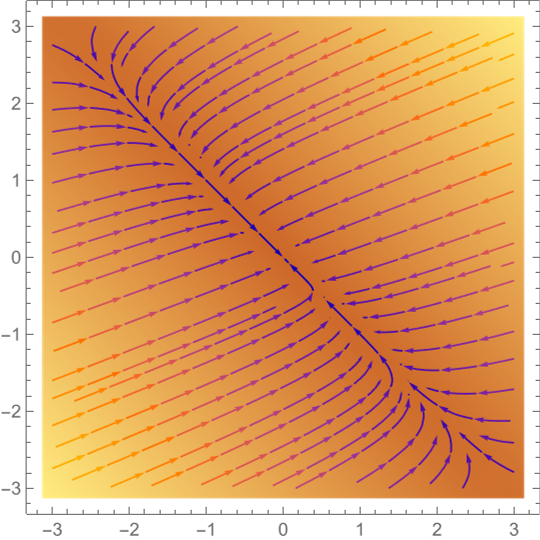
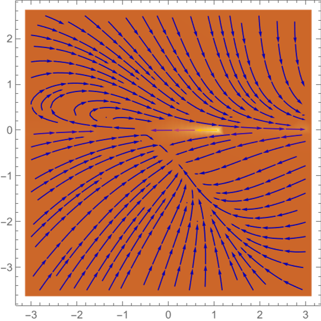
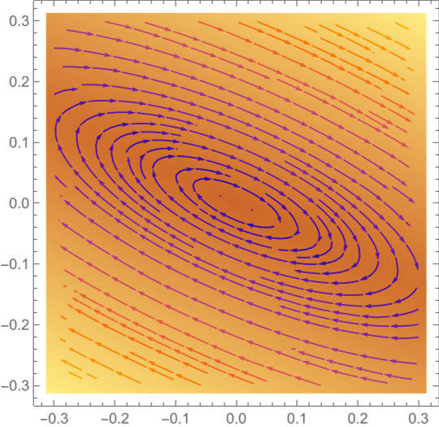
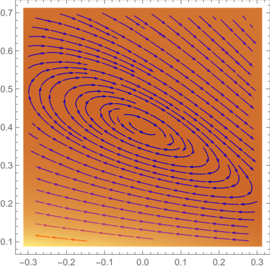

<h1 align=center>Качественно-аналитическое исследование систем ОДУ</h1>

  *В ходе выполнения курсовой работы качественно-аналитическим методом была исследована система ОДУ.*

*Фазовые портреты нелинейных систем на
плоскости можно исследовать, переходя к линеаризации. Для этого надо вычислить
матрицу Якоби правой части системы в особой точке — она и будет матрицей линеаризованной системы. Если линеаризация имеет особую точку типа узел, фокус
или седло, фазовый портрет исходной (нелинейной) системы в окрестности особой
точки похож на фазовый портрет линеаризации. Для центров это неверно: центры
по линейным членам могут выглядеть как фокусы. К особым точкам с вырожденной
матрицей линеаризации этот метод неприменим.*

*В работе также представлены рисунки фазовых портретов и графики аналитического решения системы, выполненные с использованием математического пакета
Wolfram Mathematica.*

<table>
<tr>
<td> </td>
 <td></td>
 <td> </td>
 <td></td>
</tr>
</table>
