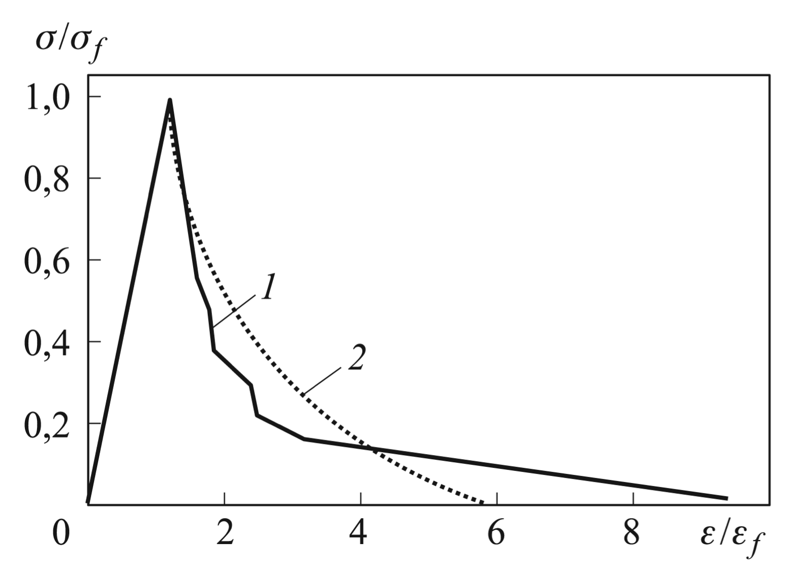
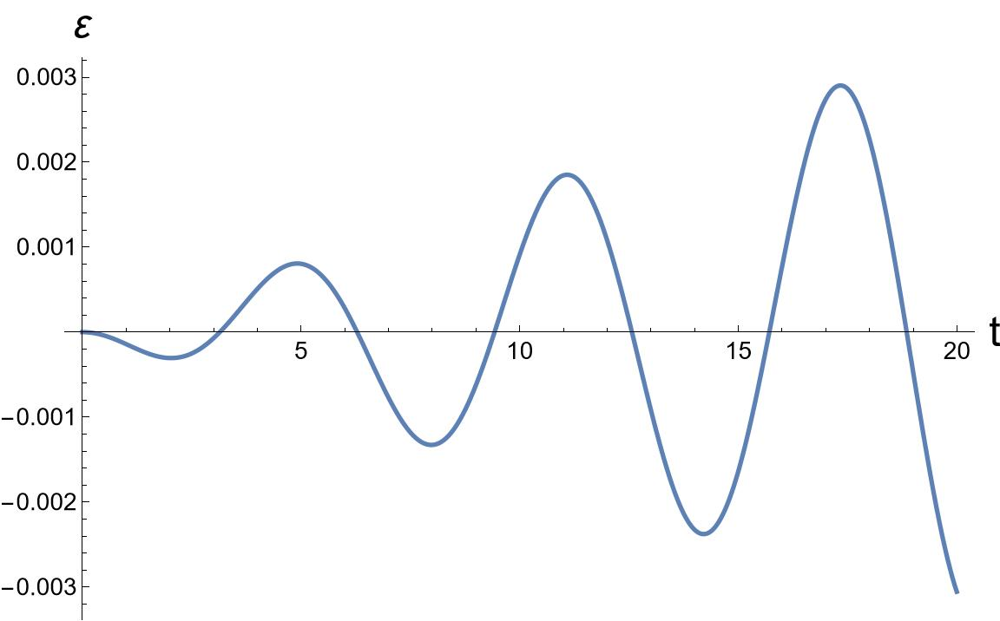
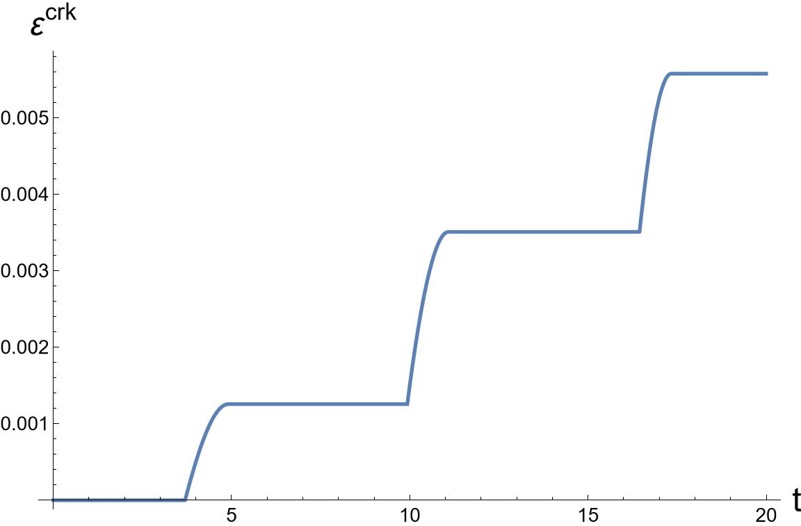
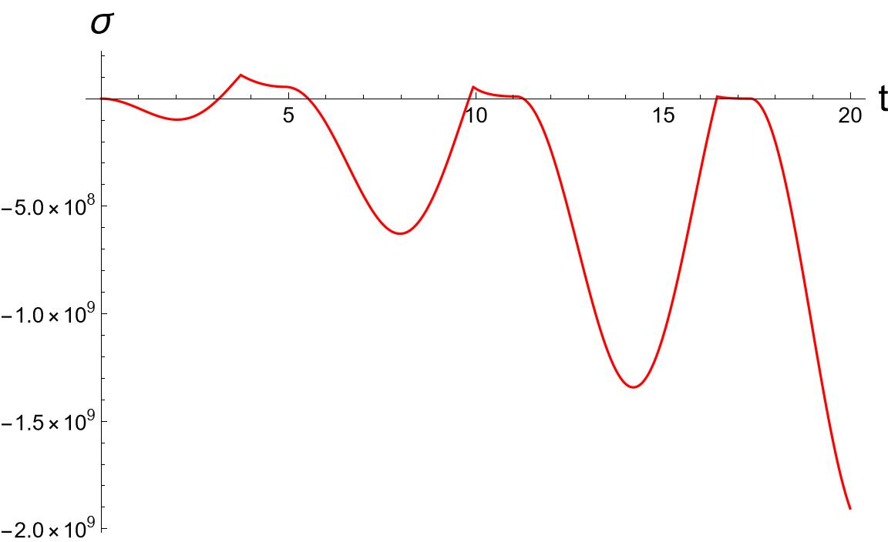
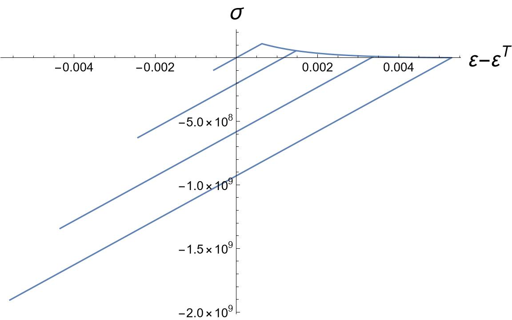
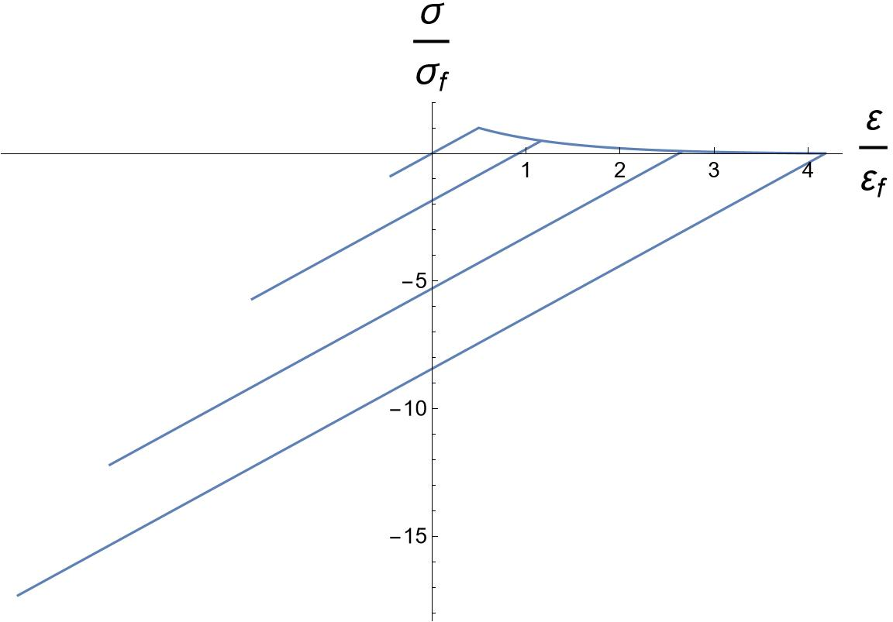

<h1 align=center>Математическое моделирование термоупругого разрушения хрупкого материала</h1>

***Цель настоящей работы — построение и анализ одномерной модели разрушения стержня, обладающего физическими свойствами и характеристиками диоксида урана (UO2), а также рассмотрение аналитического решения для линейного случая.***

### Использована модель размазанных трещин
<table>
<tr>  </tr>
</table>

### Результаты вычислений
<table>
<tr>
<td>  </td>
<td>  </td>
<td>  </td>
</tr>
</table>

<table>
<tr>
<td>  </td>
<td>  </td>
</tr>
</table>

*В настоящей работе рассмотрена задача термоупругости для одномерного случая. Была исследована математическая модель разрушения стержня, состоящего из диоксида урана UO2 и было найдено аналитическое решение для линейного случая.*

*Данная задача была решена методом конечных разностей на равномерной сетке. Также, проведен графический анализ распространения трещин, основанный на графиках напряжений, деформаций и температур.
Решение вышеуказанной задачи было реализовано в системе компьютерной алгебры Wolfram Mathematica.*
