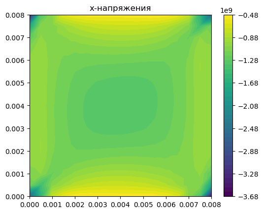
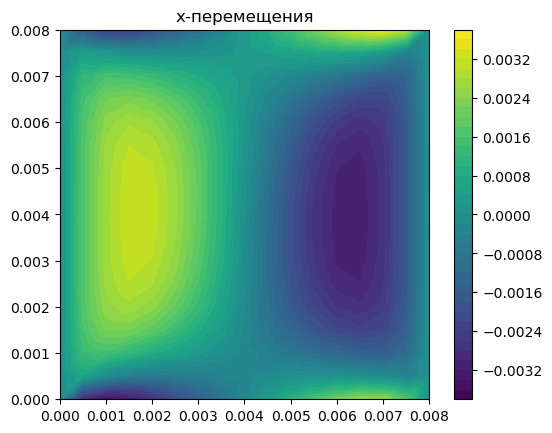
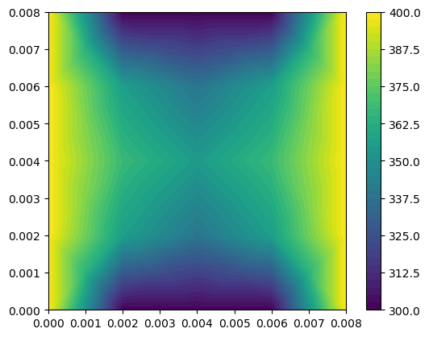
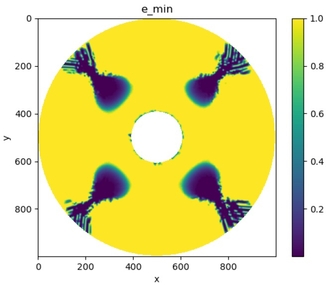
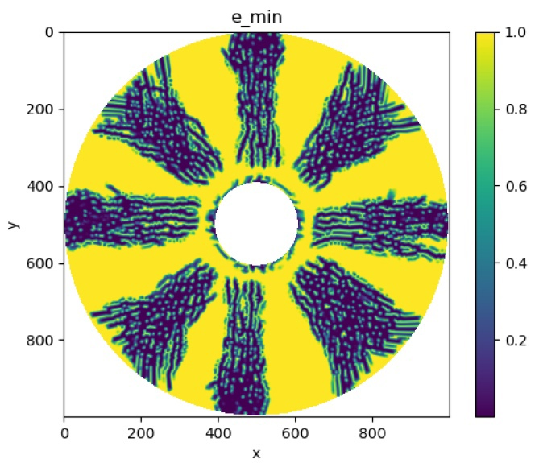
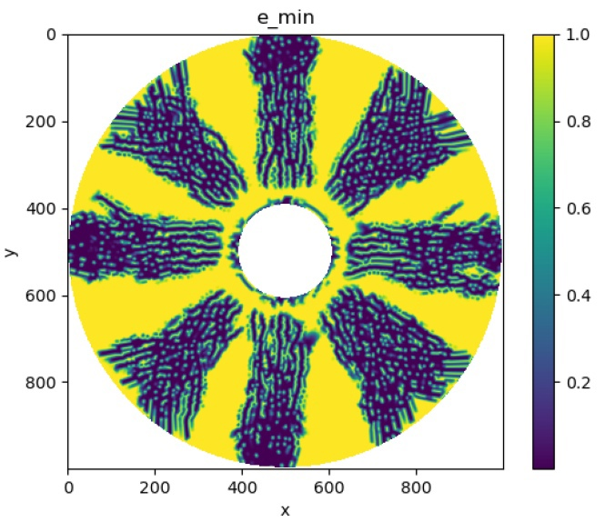

<h1 align=center>Численное моделирование напряженно-деформированного состояния твердого тела</h1>

***Цель работы - рассмотрение двумерной (плоской) задачи термоупругости, построение конечно-элементного алгоритма для нахождения решения на треугольной сетке, а также визуализация и графическое представление результатов***

### Использована модель размазанных трещин
<table>
<tr>  </tr>
</table>

### Результаты вычислений
<table>
<tr>
<td>  </td>
<td>  </td>
<td>  </td>
</tr>
</table>

### Распространение трещин
<table>
<tr>
<td>  </td>
<td>  </td>
<td>  </td>
</tr>
</table>

*Была исследована математическая модель разрушения пластины, состоящей из диоксида урана UO2. Данная задача была решена методом конечных элементов на треугольной сетке. Для тестовой задачи подтвержден порядок точности схемы.
Проведено математическое моделирование разрушения топливной таблетки в двумерной задаче, описывающей горизонтальное сечение. Применение описанной модели размазанных трещин приводит к непротиворечивым результатам.*

*Решение вышеуказанной задачи было реализовано с помощью библиотеки FEniCS на языке программирования «Python».*
